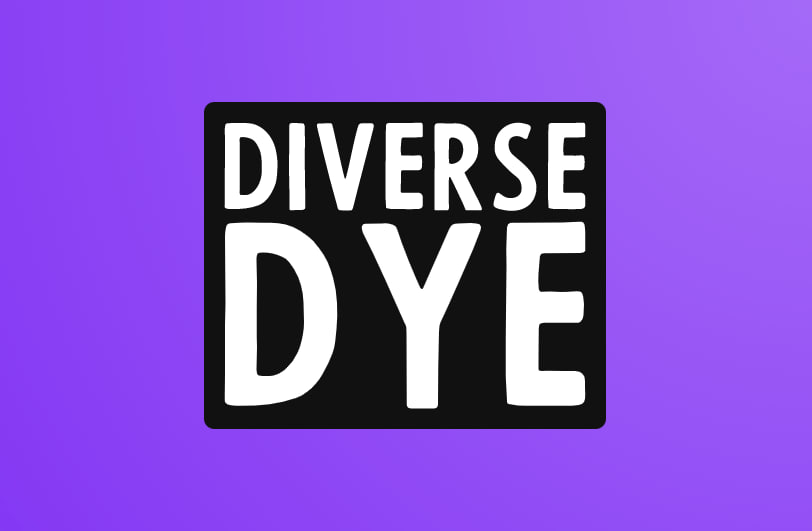
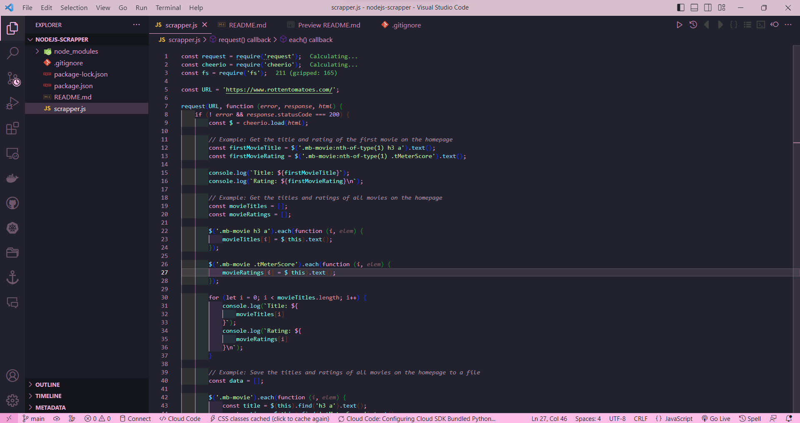

  

 

Inject a splash of color into your coding with Diverse Dye!

#### Sakura

 

#### Sakura

 

Diverse Dye is a VSC extension that provides a collection of random color themes for your code editor. With Diverse Dye, you can choose from a variety of visually appealing and unique color schemes that will make your coding experience more fun and enjoyable.

## 🎉 Features

- A collection of random color themes to choose from.
- Easy installation and setup.
- Customizable options to fit your preferences.
- Regular updates with new color schemes added.

## 🚀 Getting Started

To use Diverse Dye, simply follow these steps:

1. Open the Extensions panel in your Visual Studio Code editor.
2. Search for "Diverse Dye" and click Install.
3. Once the installation is complete, select the color theme of your choice from the dropdown list in the editor toolbar.
4. Enjoy a fresh and unique coding experience!

## 🤝 Contributing

We welcome contributions from the community! To contribute to Diverse Dye, please follow these steps:

1. Fork the repository.
2. Create a new branch for your changes.
3. Make your changes and commit them.
4. Submit a pull request.

## 📝 License

Diverse Dye is licensed under the MIT License. See the [LICENSE](LICENSE) file for more details.

## 📧 Contact

If you have any questions or feedback, feel free to contact the author at devangtomar123@gmail.com.
