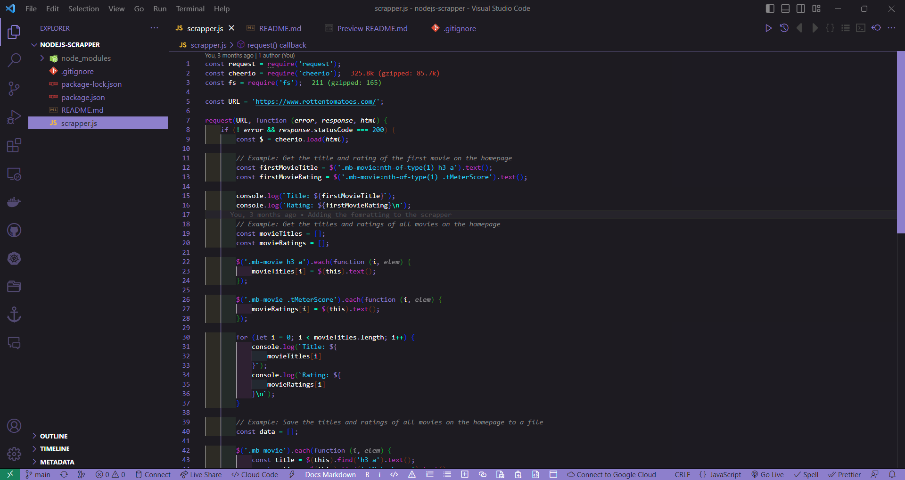
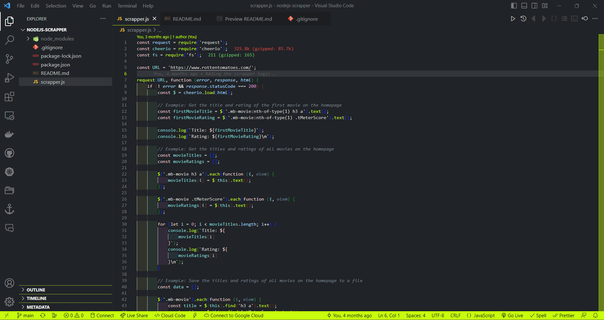

<div align="center">
  

</br>

[](https://marketplace.visualstudio.com/items?itemName=DevangTomar.vscode-diverse-dye)
[](https://marketplace.visualstudio.com/items?itemName=shubham-saudolla.lilac)
[](https://marketplace.visualstudio.com/items?itemName=shubham-saudolla.lilac)

Inject a splash of color into your coding with Diverse Dye!

#### Sakura

<a href="" target="_blank"></a>
</br>

#### Purplexed

<a href="" target="_blank"></a>
</br>

#### Neon

<a href="" target="_blank"></a>
</br>

[](https://code.visualstudio.com/download)
</div>

---

Diverse Dye is a VSC extension that provides a collection of random but eye-pleasing color themes for your code editor. With Diverse Dye, you can choose from a variety of visually appealing and unique color schemes that will make your coding experience more fun and enjoyable.

## 🎉 Features

- A collection of random but eye-pleasing color themes to choose from.
- Easy installation and setup.
- Customizable options to fit your preferences.
- Regular updates with new color schemes added.

## 🐰 Easy Installation

To install the color theme, just use the extensions tab within VS Code and search for 'Diverse Dye'.

Once installed, themes can be switched using the menu item `Code -> Preferences -> Color Theme`.

## ⚙️ Manual Installation

Clone the repository into `~/.vscode/extensions` and restart the editor.

## 🚀 Getting Started

To use Diverse Dye, simply follow these steps:

1. Open the Extensions panel in your Visual Studio Code editor.
2. Search for "Diverse Dye" and click Install.
3. Once the installation is complete, select the color theme of your choice from the dropdown list in the editor toolbar.
4. Enjoy a fresh and unique coding experience!

## 🤝 Contributing

We welcome contributions from the community! To contribute to Diverse Dye, please follow these steps:

1. Fork the repository.
2. Create a new branch for your changes.
3. Make your changes and commit them.
4. Submit a pull request.

## 📝 License

Diverse Dye is licensed under the MIT License. See the [LICENSE](LICENSE) file for more details.

## 📧 Contact

If you have any questions or feedback, feel free to contact the author at devangtomar123@gmail.com.

## Useful Information

To override the status bar colors, add the following to your settings JSON. (Change the colors as you see fit.)

```json
"workbench.colorCustomizations": {
    "statusBar.background": "#333",
    "statusBar.foreground": "#fff",
    "statusBar.noFolderBackground": "#333",
}
```

If you'd like to report a bug with the theme, please raise an issue with the repository.

## 💁🏻‍♀️ Support the project

To show support for the project, you can

- [Star the repository.](https://github.com/devangtomar/vscode-diverse-dye)
- [Give the theme 5 stars.](https://marketplace.visualstudio.com/items?itemName=DevangTomar.vscode-diverse-dye)
- Follow me on [GitHub](https://github.com/devangtomar) and [Instagram](https://www.instagram.com/be_ayushmann/)
<!-- - [Donate via PayPal.](https://paypal.me/devangtomar) -->

👾 Devang.
